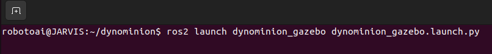
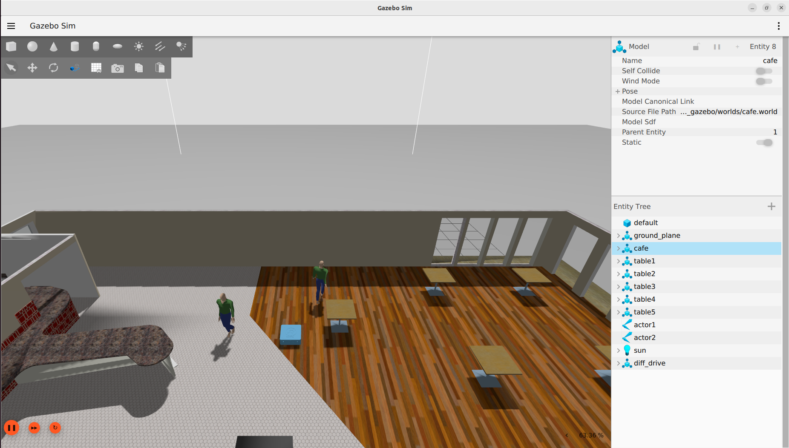
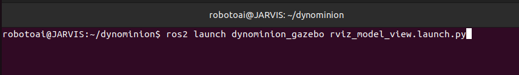
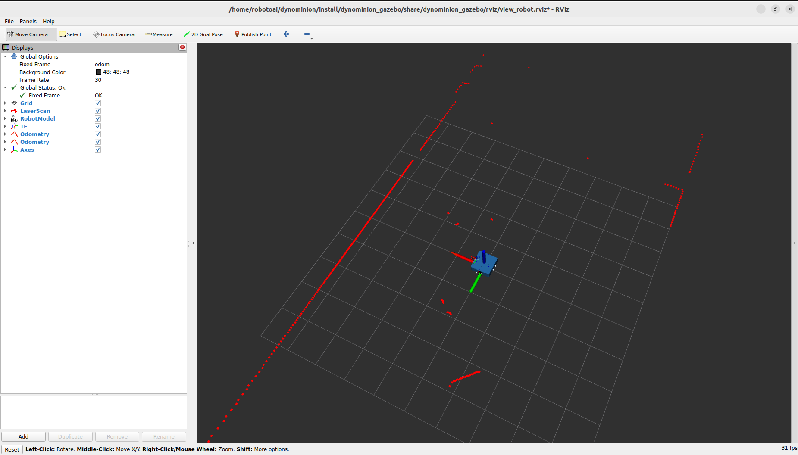

# dynominion_rmf_gazebo

## Overview

The dynominion_rmf_gazebo package integrates Gazebo sensor plugins along with the gazebo_ros2_control plugin to create a complete simulation environment for the Dynominion_rmf robot.

It is responsible for generating the Gazebo world, spawning the Dynominion_rmf URDF model, and establishing seamless communication between Gazebo and ROS 2.

This package enables real-time interaction, control, and visualization of the robot within a simulated environment, combining physical simulation, ROS 2 interfaces, and customizable worlds and models for testing and development.

All 3D models used in the simulation are stored in the models/ folder, while the Gazebo world definitions are located in the worlds/ folder.

This package includes two launch files: - dyniminion_gazebo.launch.py: Spawns the Dynominion_rmf robot in the Gazebo world and establishes communication between Gazebo and ROS 2. - rviz_model_view.launch.py: Visualizes the Dynominion_rmf robot in RViz2 using a fixed reference frame.


---

## Package Structure

```
dynominion_rmf_gazebo
├── CMakeLists.txt
├── config/
│   ├── diff_drive_controller.yaml
│   └── gz_bridge.yaml
├── dynominion_rmf_gazebo/
│   ├── __init__.py
│   ├── joint_state_republisher.py
│   └── odom_modifier.py
├── launch/
│   ├── dynominion_rmf_gazebo.launch.py
│   └── rviz_model_view.launch.py
├── models/
│   ├── Cafe/
│   ├── Cafe_table/
│   ├── actor/
│   └── male_visitor/
├── package.xml
├── rviz/
│   └── view_robot.rviz
├── urdf/
│   ├── dynominion_rmf.urdf.xacro
│   ├── gazebo_ros2_control.xacro
│   └── gazebo_sensor_plugin.xacro
└── worlds/
    └── cafe.world
```
## Requirements

| Package | Purpose |
|---------|---------|
| `gazebo_ros` | Provides ROS 2 integration with Gazebo simulator |
| `gazebo_ros2_control` | Enables ros2_control interface inside Gazebo |
| `ros2_control` | Framework for controlling robot hardware and actuators |
| `controller_manager` | Loads and manages robot controllers |
| `xacro` | Generates URDF files using macros |
| `urdf` | Defines robot physical and visual description |
| `robot_state_publisher` | Publishes TF transforms based on robot URDF |


## Launch Gazebo Simulation

```bash
ros2 launch dynominion_rmf_gazebo dynominion_rmf_gazebo.launch.py
```





---

## Launch RViz Visualization

```bash
ros2 launch dynominion_rmf_gazebo rviz_model_view.launch.py
```





---

