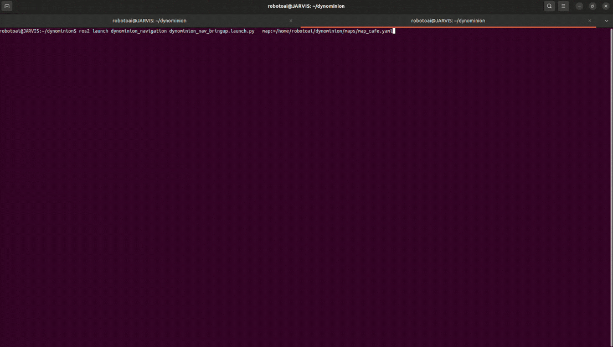

# DYNOMINION_RMF X Simulation

### Launch

Dynominion_rmf X simulation has multiple launch files for its operation. The following passages are in the form of description of launch file and launch command.

1. To launch Gazebo simulation, run

```bash
ros2 launch dynominion_rmf_gazebo dynominion_rmf_gazebo.launch.py
```


2. To start mapping with online async mode, run

```bash
ros2 launch dynominion_rmf_slam online_async_launch.py
```


3. To start navigation, run

```bash
ros2 launch dynominion_rmf_navigation dynominion_rmf_nav_bringup.launch.py
```


